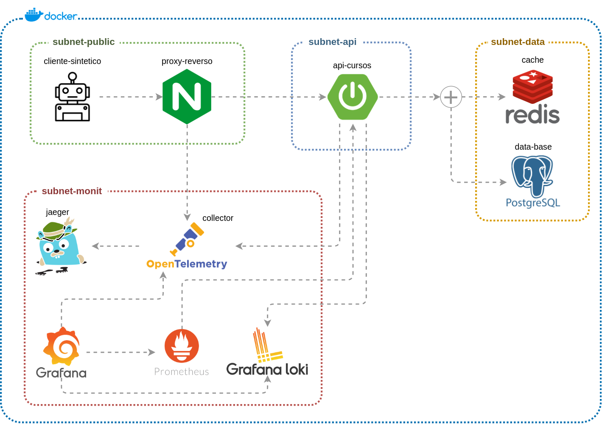
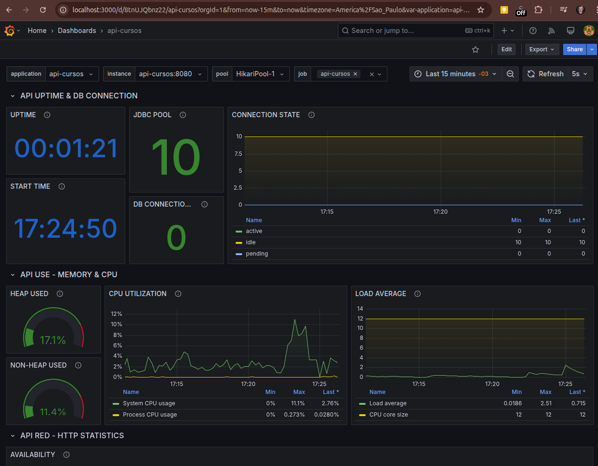

## Rastreamento e Monitoramento: Implementando Tracing com Jaeger, OpenTelemetry, Prometheus, Grafana e Loki

Este projeto tem como objetivo implementar uma solução robusta de rastreamento distribuído e monitoramento de performance utilizando Jaeger, OpenTelemetry, Prometheus, Grafana e Grafana Loki. Através dessa abordagem, buscamos fornecer uma visibilidade completa do comportamento e desempenho de sistemas distribuídos, como microsserviços, ao longo de toda a sua execução, identificando gargalos, falhas e pontos de melhoria.

### Desenho da arquitetura desse projeto



### Arquitetura Limpa

O projeto foi modificado para usar a arquitetura limpa.

#### 1. Entenda os princípios da Arquitetura Limpa:

Base: [Clean Architecture - Uncle Bob](https://8thlight.com/blog/uncle-bob/2012/08/13/the-clean-architecture.html)

- Camadas concêntricas com regras de dependência que apontam sempre para o centro.
- Separação clara entre lógica de negócio (núcleo) e infraestrutura.

#### 2. Defina os pacotes por camada:

``` SHELL
br.com.cursos
├── application      # Casos de uso
│   └── domain       # Entidades e regras de negócio
│       └── model
│       └── repository
│   └── usecase
├── infrastructure   # Adapters externos (DB, APIs, etc.)
│   └── config
│   └── exceptions   # Exceptions da aplicação
│   └── persistence
│   └── service
├── interfaces       # Controllers e Gateways
│   └── controller
│   └── dto
│   └── handlers
```

### Executando apenas a API, fora do docker

Para executar apenas a aplicação dentro do IntelliJ, por exemplo, execute:

1. Execute: `local-start.sh` - Será iniciado apenas o banco de dados e Redis em docker (Configuração do banco mais abaixo).
2. Você poderá executar a aplicação no IntelliJ, pois ele encontrará o banco e o Redis.

### Swagger da aplicação

Acesse: [http://localhost:8080/swagger-ui.html](http://localhost:8080/swagger-ui.html).

Também é possível usar o Postman, só obter a collection `postman/api-cursos.postman_collection.json`.

### Dados para testes

Execute o arquivo `cadastrar_cursos.sh`, quando a aplicação estiver em execução local, para fazer vários cadastros.

### Ferramentas Utilizadas

1. **Jaeger**: Jaeger é uma plataforma de rastreamento distribuído de código aberto que fornece a coleta, o armazenamento e a visualização das traces geradas em sistemas distribuídos. Com o Jaeger, é possível monitorar a jornada de cada requisição, identificar latências e entender o comportamento entre os microsserviços.

2. **OpenTelemetry**: OpenTelemetry é um framework unificado para coletar dados de observabilidade (tracing, métricas e logs) de diferentes fontes. Ele oferece uma API e bibliotecas para instrumentar as aplicações de forma eficiente e enviar os dados para ferramentas como Jaeger, Prometheus, entre outras.

3. **Prometheus**: Prometheus é uma ferramenta de monitoramento e coleta de métricas, especialmente útil para sistemas distribuídos. Ele coleta métricas em tempo real de suas aplicações e armazena em um formato de séries temporais. A integração com OpenTelemetry facilita a coleta dessas métricas diretamente das aplicações instrumentadas.

4. **Grafana**: Grafana é uma plataforma de visualização de dados que se integra com o Prometheus para criar dashboards interativos e ricos, permitindo uma visualização clara de métricas de desempenho. Com o Grafana, é possível construir visualizações de tempo real que ajudam a identificar problemas de performance e monitorar a saúde do sistema.

5. **Grafana Loki**: Loki é uma ferramenta de agregação de logs desenvolvida pelo time do Grafana. Ele coleta, armazena e consulta logs de forma eficiente, sendo altamente integrado ao Grafana. Isso permite combinar métricas, traces e logs em uma única interface, proporcionando uma visão completa do comportamento do sistema.

### Como Funciona a Solução?
* **Rastreamento com Jaeger e OpenTelemetry**: OpenTelemetry é utilizado para instrumentar a aplicação, gerando traces que são enviados ao Jaeger, onde são armazenados e visualizados. Isso permite acompanhar a jornada das requisições entre os diferentes microsserviços.

* **Coleta de Métricas com Prometheus**: O Prometheus coleta métricas das aplicações instrumentadas via OpenTelemetry, como tempos de resposta, uso de CPU, latência de rede, entre outras, e armazena essas métricas em séries temporais.

* **Visualização com Grafana**: O Grafana conecta-se ao Prometheus para visualizar as métricas em dashboards interativos, e também pode ser integrado ao Jaeger para correlacionar as traces com as métricas, facilitando a análise de performance.

* **Logs com Grafana Loki**: Os logs gerados pelas aplicações são coletados pelo Loki, sendo visualizados também no Grafana, permitindo que métricas e logs sejam acessados a partir de uma interface única, tornando a análise mais completa e eficiente.

## Benefícios da Solução

* **Visibilidade Completa**: A combinação de Jaeger, OpenTelemetry, Prometheus, Grafana e Loki oferece uma visão holística da aplicação, permitindo acompanhar traces, métricas e logs de forma integrada.
* **Detecção Proativa de Problemas**: Através de tracing e métricas, é possível identificar rapidamente gargalos de desempenho, latências altas ou falhas, facilitando a correção proativa.
* **Análise de Performance**: As métricas coletadas pelo Prometheus, visualizadas no Grafana, fornecem uma visão clara da performance do sistema, ajudando a otimizar recursos e melhorar a experiência do usuário.
* **Centralização de Logs**: Com o Grafana Loki, a centralização e consulta de logs torna-se mais eficiente, permitindo a rápida análise em conjunto com as métricas e traces.

## Sobre observabilidade

- Definições de SLI e SLO
- Definições de thresholds e alertas
- Políticas de respostas a incidentes
- Monitoramento sintético
- Chaos Engineering
- Production Readiness Review (PRR)

### ✅ SLI (Service Level Indicator)
Métrica quantitativa que representa o comportamento real de um serviço.
Exemplos:

- Latência média de requisições
- Taxa de erro 5xx
- Disponibilidade (%)

> “O que estamos medindo?”

### ✅ SLO (Service Level Objective)
Meta quantitativa baseada em um SLI, que define o nível esperado de serviço.
Exemplo:

- 99.9% das requisições devem ter latência < 200 ms.

> “Qual nível é aceitável?”

### ✅ Thresholds e Alertas
- Threshold: valor limite definido para acionar ações.
  - Ex: erro > 1% por 5 minutos.

- Alerta: notificação gerada quando o threshold é excedido (ex: via Prometheus + Alertmanager, Grafana, etc.).

> “Quando devemos reagir?”

### ✅ Políticas de Resposta a Incidentes
Plano documentado para lidar com falhas.
Inclui:

- Definição de severidade (sev0–sev4)
- Processo de escalonamento
- Comunicação (internamente e externamente)
- Postmortem e análise de causa raiz

> “Como reagimos a falhas e evitamos repetições?”

### ✅ Monitoramento Sintético
Execução simulada de interações com o sistema para monitoramento proativo.
Exemplo:

- Health checks periódicos em endpoints críticos
- Testes simulando fluxo de usuários (login, pagamento etc.)

> “O sistema parece funcional de fora?”

### ✅ Chaos Engineering
Prática de injetar falhas controladas para validar a resiliência do sistema em produção ou ambientes equivalentes.

Exemplo: desligar instâncias, corromper dados, atrasar respostas.

> “Como o sistema reage ao inesperado?”

### ✅ Production Readiness Review (PRR)
Checklist técnico de pré-go-live garantindo que o serviço está pronto para produção.
Verifica:

- Logs, métricas, tracing
- Alarmes configurados
- Testes automatizados
- Procedimentos de rollback
- Conformidade de segurança

> “Estamos preparados para colocar isso em produção?”

# Banco de dados - Configuração:

PgAdmin 4 é uma interface gráfica de administração para o PostgreSQL, um dos sistemas de gerenciamento de banco de dados relacionais mais populares. Ele é utilizado para facilitar a interação e administração do banco de dados PostgreSQL de maneira intuitiva e visual.

Usamos o banco de dados Postgresql. Para acessar o pgadmin4: [localhost:5050/](http://localhost:5050/). Para logar, veja no `docker-compose` ou use:

- 👤 **Login**: user@domain.com
- 🔑 **Passowrd**: 112358

Depois, precisamos nos registrar no servidor conforme passos abaixo:

### Add New Server

Neste ícone, vamos nos registrar no servidor postgres, para ter acesso as bases de dados.

- 🌐 **Server name**: database-api-cursos
- 🖥️ **Host name/address**: database-api-cursos
- 👤 **Username**: postgres
- 🔑 **Password**: postgres

### Database criada no momento da subida do docker-compose

Ao executar a shell `./start.sh`, após subida do banco, os comandos abaixo são executado automaticamente para a criação do banco:

```shell
docker exec -it database-api-cursos psql -U postgres -c "CREATE DATABASE cursosdb WITH OWNER = postgres ENCODING = 'UTF8' LC_COLLATE = 'en_US.utf8' LC_CTYPE = 'en_US.utf8' LOCALE_PROVIDER = 'libc' TABLESPACE = pg_default CONNECTION LIMIT = -1 IS_TEMPLATE = False;"

docker exec -it database-api-cursos psql -U postgres -c "GRANT ALL PRIVILEGES ON DATABASE cursosdb TO postgres;"
```


# Prometheus

Prometheus é uma ferramenta de monitoramento e alerta de código aberto, usada principalmente para coletar e armazenar métricas de sistemas e serviços. Ele é amplamente utilizado para monitorar aplicações, como Spring Boot e outras APIs, fornecendo informações detalhadas sobre o desempenho e a saúde do sistema.

Para acessar o prometheus: [localhost:9090](http://localhost:9090).

### Prometheus da API

A API do projeto exibe os dados do actuator e prometheus: [localhost:8080/actuator/prometheus](http://localhost:8080/actuator/prometheus).

> ⚠️ **Observação:** Para configurar o prometheus.yml para acessar externamente a API, foi configurado o endereço do host da minha máquina local, exemplo: `192.168.0.160:8080`. Se você subir sua API em um docker, user o mesmo network e o `container_name` desse container. 

# Grafana

Grafana é uma plataforma de visualização de dados e monitoramento de código aberto que permite criar dashboards interativos e gráficos a partir de métricas e logs de sistemas, aplicações e infraestrutura. Ele é amplamente utilizado para analisar e visualizar dados em tempo real e é frequentemente usado em conjunto com ferramentas como Prometheus, Elasticsearch, Loki e outros sistemas de coleta de métricas e logs.

Podemos acessar o grafana pelo endereço: [localhost:3000/login](http://localhost:3000/login). Com os acessos:

- 👤 **Login**: admin
- 🔑 **Passowrd**: admin

> ⚠️ **Observação:** No primeiro acesso, será solicitado a troca de senha.

### ⚙️ Configurando o grafana e acessando as métricas da aplicação:

Acessando o grafana, seguir os passos:

1. Acessar "Data sources" no menu --> Add data sources
2. Selecione "Prometheus"
3. **Name**: prometheus
4. **Prometheus server URL**: [http://prometheus-api-cursos:9090](http://prometheus-api-cursos:9090)  |  A comunicação é entre "conteineres"
5. Clicar no botão `Save & test` no final da página  |  A mensagem `Successfully queried the Prometheus API.` deve aparecer

### ⚙️ Configurando o grafana para ter acesso ao Loki:

1. Acessar "Data sources" no menu --> Add data sources
2. Selecione "Loki"
3. **Name**: loki
4. **Prometheus server URL**: [http://loki-api-cursos:3100](http://loki-api-cursos:3100)  |  A comunicação é entre "conteineres"
5. Clicar no botão `Save & test` no final da página  |  A mensagem `Data source successfully connected.` deve aparecer

### Importar o dashboard da API Cursos

Já temos um template do dashboard da API Cursos. Seguir os passos para importar:

1. Acesse [http://localhost:3000/dashboards](http://localhost:3000/dashboards) do Grafana
2. Clique em `Import a dashboard`
3. Importe o json: `template/api-cursos-dashboard.json`, que está dentro do projeto
4. Escolha o name e o folder que quiser, e depois `Import`

> ⚠️ Dando tudo certo, você já verá algumas informações da API em execução.



# Grafana Loki

Grafana Loki é uma ferramenta de agregação e consulta de logs de código aberto, projetada para trabalhar de forma integrada com o Grafana. Ao contrário de outras soluções de logs, o Loki foi criado para ser simples, eficiente e escalável, com foco na otimização de armazenamento e consulta.

# Jaeger

Para acessar o Jaeger, pois ele não